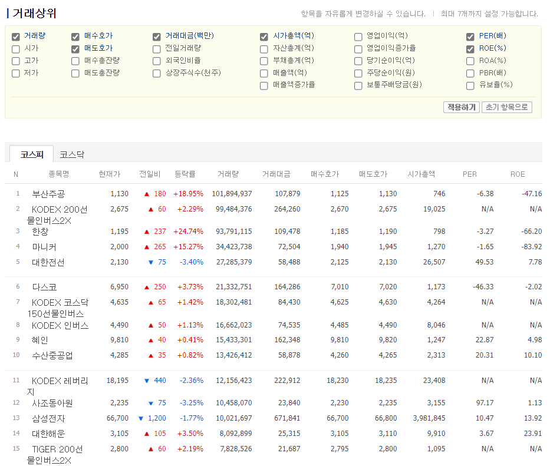
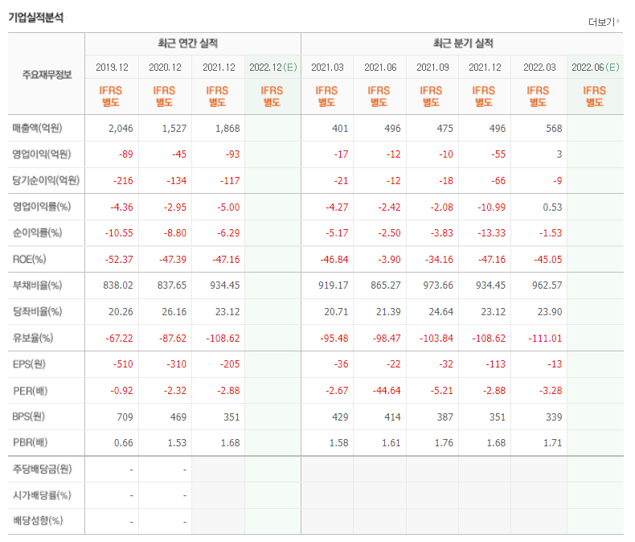
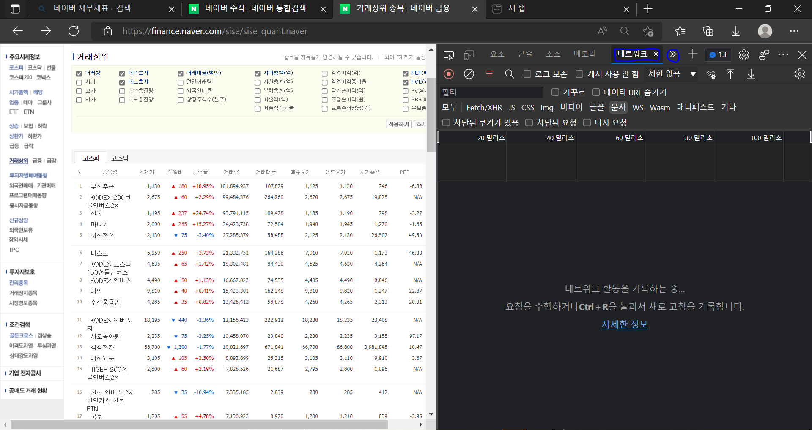
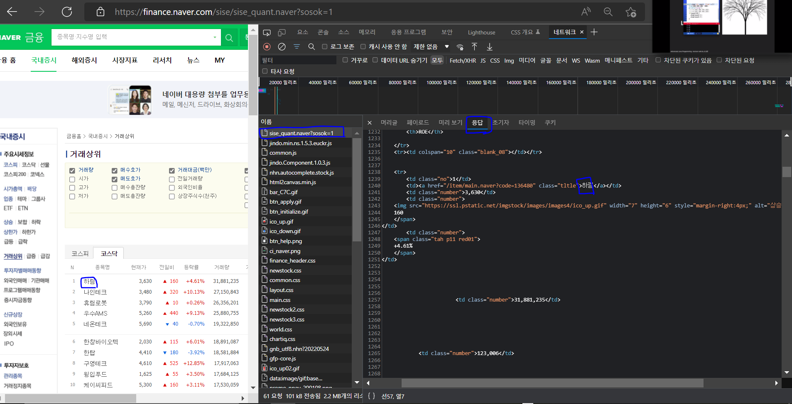

# **3주차 미션 - 심화 버젼**

<br/>

## **미션 : 네이버 재무제표 크롤링1**

<br/>

크롤링 링크 : https://finance.naver.com/sise/sise_quant.naver?sosok=0

### **목표**



1. 거래 상위 종목들의 재무제표를 크롤링한다



2. 크롤링한 후 ROE, PER, PBR 등 다양한 퍼센트를 주고 계산하여 주식 종목 추천 크롤링 봇을 만든다
3. 이번에 할건 재무제표만 크롤링해서 item에 담는 것

<br/>

### **접근방법**

재무제표는 동적 웹페이지기에 xpath로 추출이 안된다. 따라서 파이썬 request 함수를 사용하여 각 종목들을 불러 올 것이다.

#### **개발자모드 열기**

https://finance.naver.com/sise/sise_quant.naver?sosok=0 <- 여기 링크에 들어가 개발자모드를 열것이다. 개발자모드는 ctrl + shift + i 를 눌러 개발자 모드를 열자




1. 개발자모드 열어서 네트워크 누르면 된다
2. 네트워크를 누른 후 녹화(빨간 버튼)을 누르고 새로고침을 하면 html 파일 부터 시작해 웹페이지에서 사용자에게 내보내는 모든 파일들이 나올 것



3. 맨 위에 뜨는 https://finance.naver.com/sise/sise_quant.naver?sosok=0 이거 누르고 응답을 보면 우리가 추출하고 싶은 종목명들이 나온다.
이걸 xpath로 추출하면 안나오고 request 함수를 통해 응답받은 것들을 그대로 text 형태로 불러오는것이다.

참고로 sosok=0은 코스닥을 sosok=1은 코스피를 뜻한다. 

<br/>

### **코드 작성**

request 함수를 호출하려면 import를 시켜준 후 request.get(URL).text를 하면 된다.
```
import requests

request.get('https://finance.naver.com/sise/sise_quant.naver?sosok=0').text
```
한번 a = request 이런식으로 변수 선언을 해서 print문으로 어떻게 출력 되는지 확인해 보길!!

이후 세부 URL로 들어가는 item 추출 후 추출한 item과 뒷 url를 합쳐 재무제표를 크롤링 하면 된다.

<br/>

### **향후 계획**

재무제표를 토대로 주식종목 추천 봇을 만들것이다. 종목 추천기준은  매출액, 영업이익, ROE, PER, PBR 등 사용자가 원하는 퍼센트를 곱해 기준을 통과하는 종목들을 추천해주는 크롤링 봇을 만들것이고 추천방식은 **이메일전송 or 텔레그램봇을 이용할것이다**. 따라서 계속 진행하기 위해선 string형으로 크콜링한 item들을 int형으로 바꾸고 연별로 어떻게 분류를 할것인지 고민해봐야 된다 😙
